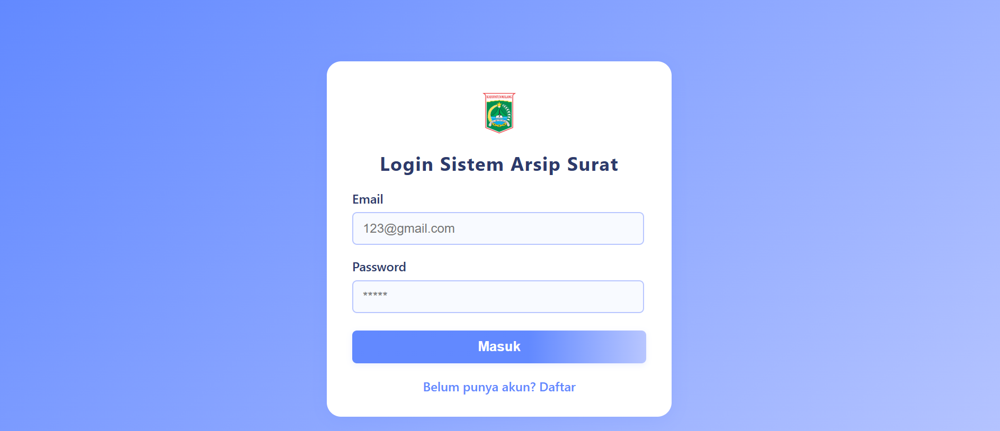
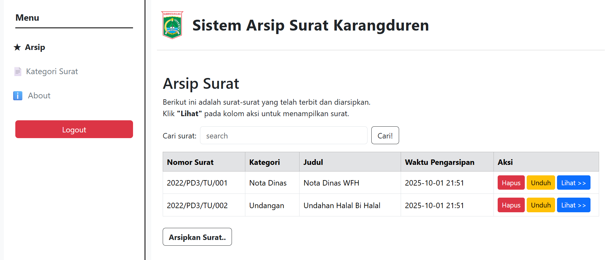
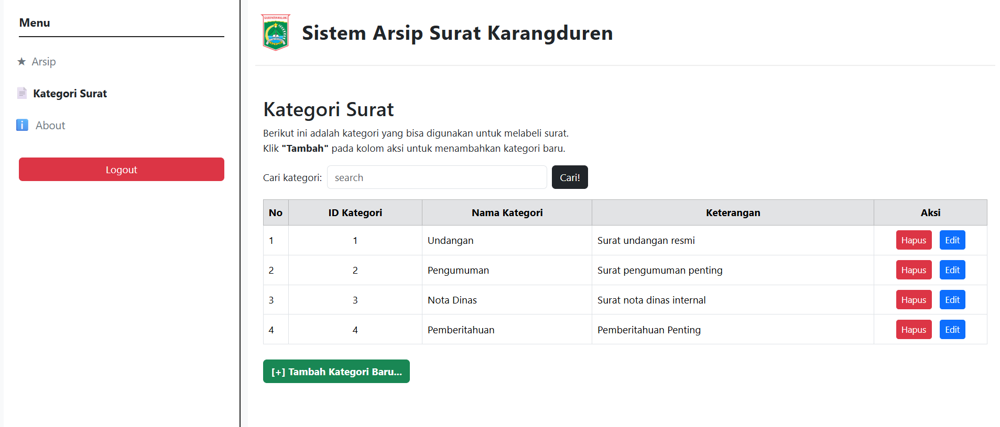
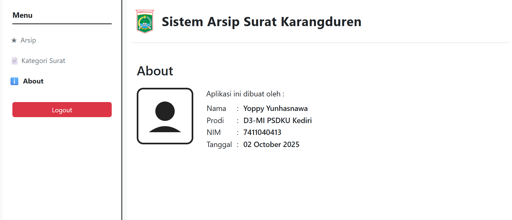

# Sistem Arsip Surat Karangduren

Aplikasi web untuk mengelola arsip surat digital di lingkungan Karangduren. Sistem ini memudahkan pencatatan, pengarsipan, pencarian, dan pengelolaan surat masuk/keluar secara elektronik.

## Tujuan

- Mempermudah proses pengarsipan dan pencarian surat.
- Mengurangi penggunaan kertas dan ruang penyimpanan fisik.
- Menyediakan akses cepat dan aman terhadap dokumen surat.

## Fitur

- **Manajemen Surat:** Tambah, edit, hapus, dan lihat detail surat.
- **Kategori Surat:** Pengelompokan surat berdasarkan kategori.
- **Upload PDF:** Setiap surat dapat diunggah dalam format PDF.
- **Pencarian Surat:** Cari surat berdasarkan nomor, judul, atau kategori.
- **Manajemen User:** Registrasi, login, dan logout user.
- **Keamanan:** Autentikasi, otorisasi, dan proteksi CSRF.
- **Responsive Design:** Tampilan nyaman di desktop maupun mobile.

## Cara Menjalankan

1. **Clone repository**
   ```bash
   git clone <repo-url>
   cd arsip-surat

2. Install dependency
    ```composer install 
```npm install && npm run build`

3. Copy file environment
    ```cp .env.example .env

4. cp .env.example .env

5. Generate key
```php artisan key:generate`

6. Migrasi dan seeder database
    ```php artisan migrate:fresh --seed`

7. Jalankan server
    ```php artisan serve`

8. Akses aplikasi Buka browser ke http://localhost:8000

## Screenshot




